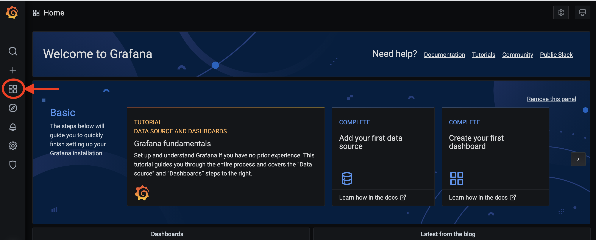
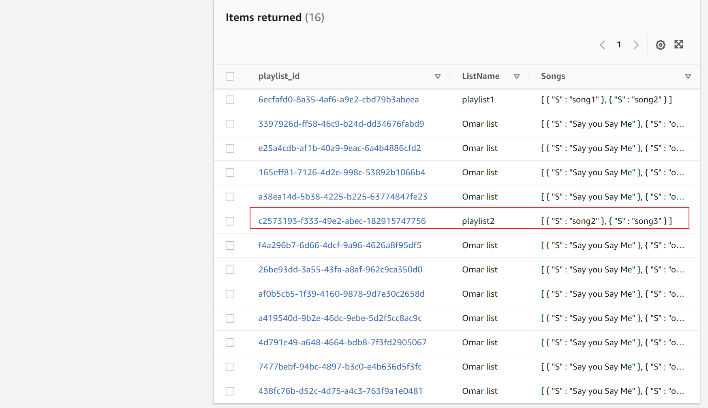
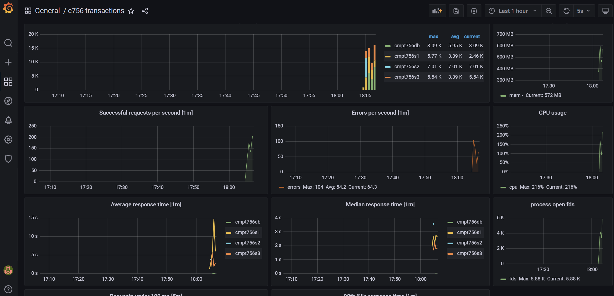

[](https://classroom.github.com/online_ide?assignment_repo_id=7078972&assignment_repo_type=AssignmentRepo)


# Serverless-coders distributed service

## 📂 Directory structure

- `cluster`: Configuration files for our cluster
- `db`: This is the for the database service
- `docs`: Contains resources for documentation
- `gatling`: Scala scripts that gatling uses to generate test load on our application
- `loader`: The loader service used to insert fake data into the our DynamoDB service
- `logs`: Where logs are stored
- `mcli`: For the music cli
- `s1`: This is the user service
- `s2`: This is the music service
- `s3`: This is the playlist service
- `tools`: For quick scripts that are useful in make-files

## ♐ Getting started

### 1. Install dependencies

- istioctl: [Link](https://istio.io/latest/docs/ops/diagnostic-tools/istioctl/)
- kubectl: [Link](https://kubernetes.io/docs/tasks/tools/)
- helm: [Link](https://helm.sh/docs/helm/helm_install/)
- aws: [Link](https://docs.aws.amazon.com/cli/latest/userguide/getting-started-install.html)
- eksctl: [Link](https://docs.aws.amazon.com/eks/latest/userguide/eksctl.html)

### 2. Generating the make files from templates

Fill in `clusters/tpl-vars.txt` with the appropriate information. Then run:

```sh
make -f k8s-tpl.mak templates
```

### 3. Login using aws configure (use if not using `tools/shell.sh`)

```sh
aws configure
```

and copy-paste the info from `clusters/tpl-vars.txt` into the prompts

## 🪂 Deployments

This section assumes that all steps in the *getting started* section has been complete!

### 1. Set up EKS

Create our cluster with 2 nodes:

```sh
make -f eks.mak start
```

and view the clusters with:

```sh
kubectl config get-contexts
```

### 2. Create namespace for our cluster

The context name for our EKS cluster above is **aws756**. So we use that context-name for `kubectl` like so:

```sh
kubectl config use-context aws756
kubectl create ns c756ns
kubectl config set-context aws756 --namespace=c756ns
```

### 3. Building docker images and pushing to github container registry

Now, we need to build images for the database service, user service, music service, playlist service, and the data loader! To do so, run:

```sh
make -f k8s.mak cri
```

Once that command is complete, go to your *packages* location on github and make each of the images public!

### 4. Deploying our services to the cluster

Now we are finally ready to deploy our services to the cluster. Do so by running:

```sh
istioctl install --set profile=demo -y
make -f k8s.mak dynamodb-init
make -f k8s.mak gw db s2 s3 s1
```

### 5. Get external IP of our application

To get the external IP of our application (to send requests or view dashboards such as Grafana), run:

```sh
kubectl -n istio-system get service istio-ingressgateway | cut -c -140
```

### 6. Setting up the autoscaler

To make sure our application can handle heavy loads, we make use of the kubernetes autoscaling feature. Do this by running:

```sh
kubectl autoscale deployment cmpt756db --min=5 --max=100 --cpu-percent=50
kubectl autoscale deployment cmpt756s1 --min=5 --max=100 --cpu-percent=50
kubectl autoscale deployment cmpt756s2-v1 --min=5 --max=100 --cpu-percent=50
kubectl autoscale deployment cmpt756s3 --min=5 --max=100 --cpu-percent=50
```

## 📊 Monitoring tools

Three tools are orchestrated together to create a monitoring solution for our distributed application! To set this up, run:

```sh
make -f k8s.mak provision
```

### Grafana

To get the grafana URL, run:

```sh
make -f k8s.mak grafana-url
```

and the username to log in is `admin` and password is `prom-operator`

Then navigate to:



### Prometheus

To get the prometheus URL, run:

```sh
make -f k8s.mak prometheus-url
```

### Kiali

To get the kiali URL, run:

```sh
make -f k8s.mak kiali
make -f k8s.mak kiali-url
```

## ⭕ Loader

The loader inserts data that exists in `gatling/resources/*.csv` into their respective tables (users, music, playlist). To loaddata into our dynamo DB tables, run:

```sh
make -f k8s.mak loader
```

and the data will show up if viewed in the AWS DynamoDB console:



## 🔫 Gatling

Gatling is used to generate test load which runs against our application. Is is to test the resiliency of our application under heavy loads.

### Generating test load

To generate test load on our application, run:

```sh
./gatling-<service>.sh <Number_of_service_objects> <delay_between_each_request>
```

For example, running:

```sh
./gatling-all.sh 1000 300
```

will send `1000` requests to each of the services with a `300` ms delay. The generated load can then be viewed using Grafana like so:



### Viewing the load

Simply run

```sh
docker container list
```

to view the running gatling jobs

### Stopping gatling

To stop gatling jobs, run:

```sh
./tools/kill-gatling.sh
```

## 🛑 Kill the cluster

To spin down the EKS clusters and stop everything, simple run:

```sh
make -f eks.mak stop
```
